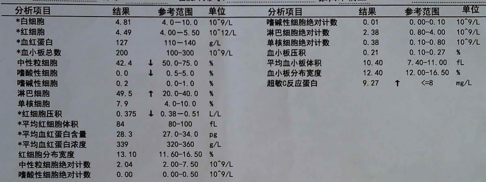
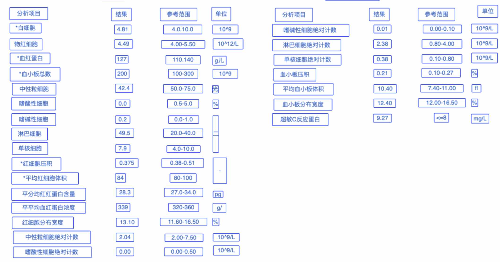

# NWCD-Industry-Customized-OCR-Solution

# 免责说明
建议测试过程中使用此方案，生产环境使用请自行考虑评估。
当您对方案需要进一步的沟通和反馈后，可以联系 nwcd_labs@nwcdcloud.cn 获得更进一步的支持。
欢迎联系参与方案共建和提交方案需求, 也欢迎在 github 项目issue中留言反馈bugs。


#  项目说明
* 使用Sagemaker 实现中文ocr模型的训练，并部署为Web服务， 提供文本识别功能。 


通过AWS Textract 或者自己训练的中文OCR模型 对图像进行ocr识别， 返回json格式的数据文件， 返回的数据包含了文本块的坐标，内容，置信度等信息。


# 识别效果展示

以下是训练20万轮的识别效果






---------------------------------
# 使用Sagemaker 训练中文OCR 模型

Amazon SageMaker 是一项完全托管的机器学习服务。借助 Amazon SageMaker，数据科学家和开发人员可以快速、轻松地构建和训练机器学习模型，然后直接将模型部署到生产就绪托管环境中。

[Sagemaker 官方文档](https://docs.aws.amazon.com/zh_cn/sagemaker/latest/dg/whatis.html)

以下两个文档包含了训练和部署的操作流程。

### 训练

[训练 sagemaker/01-train/train.ipynb](./sagemaker/01-train/train.ipynb)


## 部署

[部署 sagemaker/02-inference/inference.ipynb](./sagemaker/02-inference/inference.ipynb)


---------------------------------
# 本地环境 训练中文OCR 模型

### 测试

```
git clone https://github.com/nwcd-samples/NWCD-Industry-Customized-OCR-Solution
cd NWCD-Industry-Customized-OCR-Solution

conda create -n  ocr python=3.6
source activate ocr
cd local
pip install -r requirements.txt -i https://mirrors.163.com/pypi/simple/ 


cd ../shell
sh chinese_ocr.sh

```

### chinese_ocr.sh 脚本文件说明

```shell script
python3 ../local/ocr_main.py  \           
-i '../local/sample_data/images/' \                 # 进行识别的图片文件夹路径
-o 'output/' \                                      # 输出结果的路径
--cuda==False  \                                    # 是否使用GPU
--batch_size 64 \                                   # 批处理大小
--label_file_list  '../local/sample_data/chars.txt' \   # 字典文件
--Transformation TPS --FeatureExtraction ResNet --SequenceModeling BiLSTM --Prediction Attn \       # 网络参数
--saved_model ../local/atte/saved_models/TPS-ResNet-BiLSTM-Attn-Seed1111/best_accuracy.pth \        # 字符识别网络模型地址
--trained_model ../local/craft/weights/craft_mlt_25k.pth \                                          # 文本区域检测模型地址
--generate_train_data_dir 'output/train/' \                                                         # 置信度低的识别图片
--generate_train_confidence=0.90                                                                    # 置信度阈值， 低于这个值的图片可以重新用于样本进行训练
```


### 训练

需要准备训练数据， 请参考[ocr-text-renderer 中文文字图片生成](https://github.com/dikers/ocr-text-renderer)


```
cd local/data_generate/
sh create_lmdb.sh

# 训练数据的文件路径参考 Sagemaker 训练过程。 

cd ../atte
sh run.sh

```


-------------------------------
# 模板识别工具


业务系统需要解析很多文本图片，保存到业务系统中。 不同文件需要提取的内容不同， 直接使用OCR识别，只能识别出文本框的位置以及文本内容。
 无法结构化进行数据的提取， 比较难满足特定需求。 
 开发了一组功能来解决这个问题， 首先通过UI界面对模板进行设置，用户通过简单的UI操作，填写相关信息，生成模板内容， 后续相同类型的图像文件，会自动进行识别，并且将结构化数据导入到业务系统中。 


## 架构图 


### 识别的图像Demo


### 识别返回的数据格式


## UI截图

### 横向表格如下：  


### 纵向表格如下：  


## 图片进行ocr识别脚本

[操作步骤参考](./ocr_template/README.md)