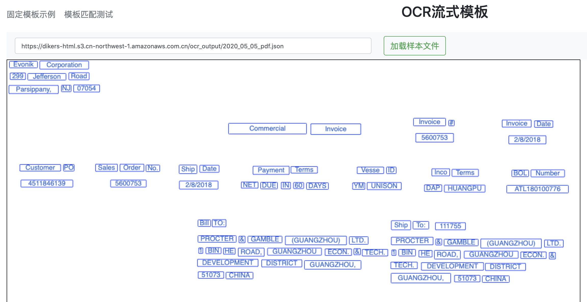

# 模板识别工具


## 第一步生成json文件

### 中文文档参考 sagemaker 训练好的ocr模型
```shell script

cd shell
sh chinese_ocr.sh

```


### 英文文档调用AWS  Textract

调用AWS Textract 服务， 将PDF image里面的文本进行识别，以json格式返回结果，
保存到国内S3中，供后面应用调用。 

[请参考代码 source/text_ocr_util.py ](source/text_ocr_util.py)
 
```shell 

# 执行脚本

cd shell
sh english_ocr.sh

# 脚本内容说明， 使用前替换成自己的AWS账号的名称
python ..//text_ocr_util.py \
--input_dir='./temp/' \                                 # pdf 或者jpg 文件路径
--output_dir='./target/' \                              # 生成json文件本地保存路径
--prefix_s3='ocr_ouput' \                               # S3 bucket 保存json文件的前缀
--global_s3_name='your_global_bucket_name' \            # Global bucket name 用于Textract 调用
--global_profile_name='your_global_profile_name' \      # Global profile name 用于Textract 调用
--cn_s3_name='your_cn_s3_name' \                        # 国内bucket name， 用于保存解析后的json文件
--cn_profile_name='your_cn_profile_name'                # 国内profile name 用于S3 调用 

```

##  第二步  上传json文件到S3中

* 将json文件设置为公开访问  **实际开发过程中， 需要设置访问权限**
* 设置S3 --> Permissions   -->  CORS configuration


设置完成以后， 可以通过浏览器的javascript 完成对json文件的访问 
```

<?xml version="1.0" encoding="UTF-8"?>
<CORSConfiguration xmlns="http://s3.amazonaws.com/doc/2006-03-01/">
<CORSRule>
    <AllowedOrigin>*</AllowedOrigin>
    <AllowedMethod>GET</AllowedMethod>
    <MaxAgeSeconds>3000</MaxAgeSeconds>
    <AllowedHeader>Content-*</AllowedHeader>
    <AllowedHeader>Host</AllowedHeader>
</CORSRule>
</CORSConfiguration>

```


##  第三步 部署web 页面

./web 目录下的文件可以部署到服务器上， 或者在本地打开， 进行操作。 

```
source/web/flow/index.html              模板设置
source/web/flow_client/index.html       模板客户端调用
```

## 第四步  设计模板

